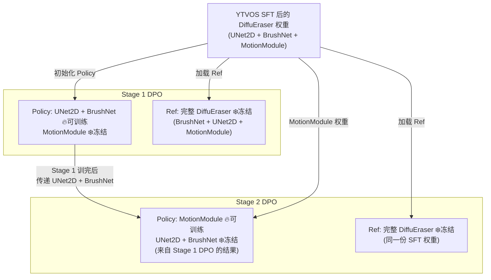

# VideoDPO → DiffuEraser 移植方案可行性审查报告

> **审查范围**：[VideoDPO_to_DiffuEraser_Report.md](file:///home/hj/Reg_DPO_Inpainting/PRD/VideoDPO_to_DiffuEraser_Report.md) + [DPO_Dataset_Generation.md](file:///home/hj/Reg_DPO_Inpainting/DPO_Dataset_Generation.md)  
> **审查基准**：VideoDPO 源码 ([ddpm3d.py](file:///home/hj/VideoDPO/lvdm/models/ddpm3d.py), [video_data.py](file:///home/hj/VideoDPO/data/video_data.py)) + DiffuEraser 训练代码 ([train_DiffuEraser_stage1.py](file:///home/hj/Reg_DPO_Inpainting/train_DiffuEraser_stage1.py), [dpo_dataset.py](file:///home/hj/Reg_DPO_Inpainting/dataset/dpo_dataset.py))

---

## 总结：5 个关键问题 + 2 个数据策略建议

| # | 严重程度 | 问题 | 类型 |
|---|---------|------|------|
| 1 | 🔴 致命 | `timesteps` 广播维度不匹配 → DPO 拼 batch 后 crash | 会报错 |
| 2 | 🔴 致命 | `dpo_dataset.py` 与数据目录结构不匹配 | 会报错 |
| 3 | 🟡 重要 | BrushNet conditioning 泄漏正负样本信息 | 可运行但不合理 |
| 4 | 🟠 中等 | 负样本纵向缝合的时域不连续性 (Stage 2) | 有隐患 |
| 5 | 🟠 中等 | `nframes` 不一致 (训练 24 vs 评分 16) | 训练可跑但语义违背设计 |
| A | 📋 建议 | DAVIS 过采样策略 | 数据平衡 |
| B | 📋 建议 | neg_1 / neg_2 混合策略 | 数据利用 |

---

## 🔴 问题 1：`timesteps` 广播维度不匹配 — 拼 batch 后 Crash

### 现状

[train_DiffuEraser_stage1.py L1045-1053](file:///home/hj/Reg_DPO_Inpainting/train_DiffuEraser_stage1.py#L1045-L1053)：

```python
bsz = latents.shape[0] // args.nframes   # = batch_size
timesteps = torch.randint(0, T, (bsz,))  # shape: (batch_size,)
noisy_latents = noise_scheduler.add_noise(latents, noise, timesteps)
```

DPO 改造后 `latents` 维度翻倍 → `add_noise` 的 timesteps 维度不匹配 → crash。

### 修复

```python
timesteps_per_batch = torch.randint(0, T, (bsz,), device=device)
timesteps_frames = timesteps_per_batch.repeat_interleave(args.nframes)  # 每帧共享
timesteps_all = timesteps_frames.repeat(2)  # pos+neg 共享
```

---

## 🔴 问题 2：`dpo_dataset.py` 与实际数据目录结构不匹配

### 现状

实际数据结构是双负样本：

```
davis_bear/
├── gt_frames/
├── masks/
├── neg_frames_1/    ← worst
├── neg_frames_2/    ← 2nd worst
└── meta.json
```

但 [dpo_dataset.py L76](file:///home/hj/Reg_DPO_Inpainting/dataset/dpo_dataset.py#L76) 读的是 `neg_frames`（单数），找不到 → 空训练集。

### 修复

需要改 dataset 支持 `neg_frames_1` / `neg_frames_2`，并在训练时策略选择（见建议 B）。

---

## 🟡 问题 3：BrushNet Conditioning 信息泄漏

### 本质

DPO 要求 pos 和 neg **收到同一道考题**。"考题" = BrushNet 的输入 = `masked_image + mask`。

当前 [dpo_dataset.py L147-150](file:///home/hj/Reg_DPO_Inpainting/dataset/dpo_dataset.py#L147-L150) 对 pos/neg 分别算了不同的 `conditioning`：

```python
pos_masked = GT帧 × (1-mask)      # 考题 A
neg_masked = neg帧 × (1-mask)     # 考题 B ← 不同的考题！
```

mask 外区域理论上应一致，但 neg_frames 是模型生成的 chimera（不同管线拼接），**mask 外像素可能有差异**。BrushNet 通过条件差异就能区分 pos/neg，**不用学习生成质量**，导致 DPO 失效（implicit_acc 虚高但生成质量不提升）。

### 正确做法

pos 和 neg **统一用 GT 的 masked image** 做 BrushNet 条件：

```python
conditioning = GT帧 × (1 - mask)  # 对 pos 和 neg 都用同一份
```

---

## 🟠 问题 4：负样本纵向缝合的时域不连续性

缝合线 `[halluc 0:16] + [blur 16:32]` 在 Stage 2 DPO（训练 MotionModule）时可能引入假的时序断裂。

**缓解方案**：DataLoader 裁剪帧窗口时对齐 16 帧 chunk 边界，或读 `meta.json` 的 chunk 信息避免跨边界采样。

**Stage 1 不受影响**（逐帧处理，无时序依赖）。

---

## 🟠 问题 5：`nframes` 不一致

当前 `train_DiffuEraser_stage1.py` 默认 `nframes=24`，但负样本是按 **16 帧粒度**评分和缝合的。

> [!IMPORTANT]
> DPO 训练的 `nframes` **必须 ≤ 16**（评分粒度），否则缝合设计的「每段都是最差」保证被打破。建议 DPO 阶段设 `nframes=16`。

---

## DPO 训练整体架构（讨论确认版）



**关键确认**：
- ref_model 两个阶段**都用同一份 YTVOS SFT 后的完整权重**，完全可行
- ref 前向必须跑完整管线（BrushNet → residuals → UNet → ε prediction），不能只跑部分模块

---

## 📋 建议 A：DAVIS 过采样策略

### 数据量分布

| 来源 | 视频数 | 占比 |
|------|--------|------|
| DAVIS | 60 | ~3% |
| YTBV | ~2000 | ~97% |

直接混合训练会导致 DAVIS 被严重欠采样。

### 方案：在 Dataset 层面对 DAVIS 做 10× 重复

```python
# DPODataset.__init__ 中
self.entries = self._load_manifest()
davis_entries = [e for e in self.entries if e["video_name"].startswith("davis_")]
ytbv_entries = [e for e in self.entries if e["video_name"].startswith("ytbv_")]
self.entries = davis_entries * 10 + ytbv_entries  # DAVIS 重复 10 次
```

**等效数据量**：60×10 + 2000 = 2600 条 entries，DAVIS 占 ~23%。

> [!NOTE]
> 这和你 SFT 时的做法一致。由于 Dataset 的 `__getitem__` 在每次访问时会**随机选起始帧 + 随机选 neg_1/neg_2 + 50% 时序翻转**，同一个 entry 被重复采样 10 次实际上会生成不同的训练样本，不会导致严格意义上的过拟合。

---

## 📋 建议 B：neg_1 / neg_2 全部展开 + 全局 Shuffle

### 方案

将每个视频的 `neg_frames_1` 和 `neg_frames_2` 展开为**两条独立 entry**，再由 DataLoader `shuffle=True` 全局打散：

```python
# Dataset.__init__ 中展开
entries = []
for video_name, info in manifest.items():
    base = {"video_name": video_name, "gt_dir": ..., "mask_dir": ..., ...}
    entries.append({**base, "neg_dir": info["neg_frames_1"], "neg_id": "neg_1"})
    entries.append({**base, "neg_dir": info["neg_frames_2"], "neg_id": "neg_2"})

# DataLoader shuffle=True → 同一视频的 neg_1 和 neg_2 被打散到 epoch 的不同位置
```

### 优势

| 对比 | 随机选 1 个 neg | 全部展开 + shuffle ✅ |
|------|----------------|----------------------|
| 每个 epoch 看到的负样本数 | 每个视频只看到 1 个 neg | 两个 neg **都看到** |
| 退化类型覆盖 | 靠概率，可能连续多 epoch 选同一个 | **确定性覆盖** |
| 同一视频 neg_1/neg_2 是否连续 | N/A | `shuffle` 打散，不会连续 |
| 等效数据量 | N | **2N** |
| 泛化能力 | 一般 | 更好 — 每个 epoch 必然覆盖多种退化类型 |

---

## 修复优先级

| 顺序 | 内容 | 影响 |
|------|------|------|
| 1 | 修复 `dpo_dataset.py` 支持 `neg_frames_1/2` + 随机选 + DAVIS 10× 过采样 | 不改就没数据 |
| 2 | 训练循环中正确处理 timesteps 广播 + pos/neg batch 拼接 | 不改就 crash |
| 3 | 统一 BrushNet conditioning 为 GT masked image | 不改 DPO 无效果 |
| 4 | 设 `nframes=16` 对齐评分粒度 | 不改缝合设计失效 |
