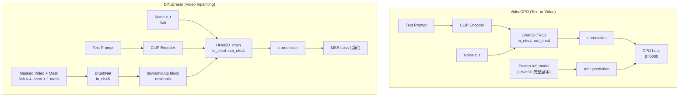
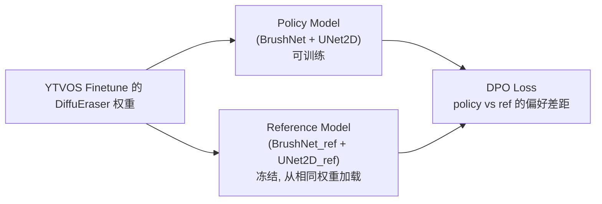
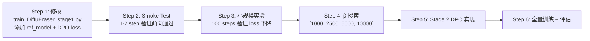

# VideoDPO → DiffuEraser 移植技术分析报告

## 1. 背景与目标

将 **VideoDPO** 的 DPO (Direct Preference Optimization) finetune 思想移植到 **DiffuEraser** 的 video inpainting 管线中。

---

## 2. 两套系统的架构对比



### 2.1 关键差异总结

| 维度 | VideoDPO | DiffuEraser |
|------|----------|-------------|
| **基底模型** | VideoCrafter2 (VC2) — 一个 3D UNet | SD v1.5 UNet2D + MotionModule (Stage 2) |
| **条件注入方式** | `crossattn` (仅文本条件注入 UNet) | BrushNet **外挂** 注入残差 → UNet2D |
| **UNet 输入通道** | 4ch (纯 latent) | UNet2D: 4ch，BrushNet: 5ch (4 latent + 1 mask) |
| **训练框架** | PyTorch Lightning | HuggingFace Accelerate |
| **ref_model** | `DiffusionWrapper(unet_config)` 冻结副本 | YTVOS finetune 后的原始 DiffuEraser 权重 |
| **DPO 数据格式** | win/lose video `cat` 在 batch dim → `chunk(2)` | `DPODataset` 返回 pos + 双 neg pair (neg_1/neg_2) |
| **训练阶段** | 单阶段: finetune 整个 UNet | 两阶段: Stage 1(UNet2D+BrushNet), Stage 2(MotionModule) |

---

## 3. 核心问题分析

### 问题 ①: 基底模型差异 (VDM vs SD1.5 + Motion Module)

**VideoDPO** 的模型只有一个 `UNet3D`，ref_model 是这个 UNet3D 的冻结副本，DPO loss 对比的是 `model(x_t, t, cond)` vs `ref_model(x_t, t, cond)` 的噪声预测差异。

**DiffuEraser** 的前向是一个 **两步级联**：
```
BrushNet(noisy_latents, t, text_emb, brushnet_cond=[masked_latent + mask])
    → down/mid/up residuals
UNet2D(noisy_latents, t, text_emb, residuals)
    → ε prediction
```

#### 解决方案

> [!IMPORTANT]
> **Diffusion-DPO loss**（区别于 LLM 上的原始 DPO）：
>
> $$\mathcal{L}_{\text{DPO}}(\theta) = -\mathbb{E}\left[\log \sigma(-\beta \cdot s(\theta))\right]$$
>
> 其中：
>
> $$s(\theta) = \underbrace{\left(\|\epsilon^w - \epsilon_\theta^w\|^2 - \|\epsilon^l - \epsilon_\theta^l\|^2\right)}_{\Delta_\theta(x^w, x^l)} - \underbrace{\left(\|\epsilon^w - \epsilon_{\text{ref}}^w\|^2 - \|\epsilon^l - \epsilon_{\text{ref}}^l\|^2\right)}_{\Delta_{\text{ref}}(x^w, x^l) \text{ (常量)}}$$
>
> **优化方向**：最小化 $\mathcal{L}_{\text{DPO}}$ 等价于让 $s(\theta) \to -\infty$，即让模型更精确地预测正样本噪声 ($\|\epsilon^w - \epsilon_\theta^w\|^2 \downarrow$)，同时降低对负样本的预测精度 ($\|\epsilon^l - \epsilon_\theta^l\|^2 \uparrow$)。

**方案：将 (BrushNet + UNet2D) 整体视为 policy model；ref_model 直接用 YTVOS finetune 后的原始 DiffuEraser 权重加载（无需 `deepcopy`）。**



```python
# ===== 伪代码 =====
# ref_model: 从 YTVOS finetune 的 checkpoint 独立加载 (不是 deepcopy)
brushnet_ref = BrushNetModel.from_pretrained(ytvos_finetune_path, subfolder="brushnet")
unet_ref = UNet2DConditionModel.from_pretrained(ytvos_finetune_path, subfolder="unet_main")
brushnet_ref.requires_grad_(False).eval()
unet_ref.requires_grad_(False).eval()

# policy model: 也从相同 checkpoint 初始化, 但参数可训练
brushnet = BrushNetModel.from_pretrained(ytvos_finetune_path, subfolder="brushnet")
unet_main = UNet2DConditionModel.from_pretrained(ytvos_finetune_path, subfolder="unet_main")

# 训练循环中
# --- Policy 前向 ---
down, mid, up = brushnet(noisy_latents, t, text_emb, cond)
model_pred = unet_main(noisy_latents, t, text_emb, down, mid, up)

# --- Reference 前向 (no_grad) ---
with torch.no_grad():
    ref_down, ref_mid, ref_up = brushnet_ref(noisy_latents, t, text_emb, cond)
    ref_pred = unet_ref(noisy_latents, t, text_emb, ref_down, ref_mid, ref_up)

# --- DPO Loss ---
dpo_loss = compute_dpo_loss(model_pred, ref_pred, noise, beta_dpo)
```

> [!NOTE]
> **显存优势**：不需要 `copy.deepcopy`，避免训练启动时的显存峰值。ref_model 从磁盘独立加载后以 fp16 冻结存放，仅占 ~3.4GB (UNet2D ~1.7GB + BrushNet ~1.7GB)。8×H200 (80GB/卡) 完全可以承受。

**DiffuEraser Stage 2 的额外注意**：

Stage 2 仅训练 MotionModule (时序注意力)，UNet2D 和 BrushNet 均冻结。此时：
- ref_model 只需要是 **MotionModule 的冻结副本** (因为 UNet2D 和 BrushNet 本身都冻结了)
- 或者更简洁地，直接用 Stage 2 训练前的 MotionModule 权重做 ref

---

### 问题 ②: 输入通道差异 (4ch vs 4+5ch)

**VideoDPO** 的 UNet 输入只有 4ch latent，DPO 的 win/lose pair 都是纯视频，在 `get_batch_input()` 中：
```python
# 数据: [win_video, lose_video] cat 在 channel dim
x = torch.cat(x.chunk(2, dim=1))  # → batch dim 翻倍
# encode
z = encode(x)  # → [2*B, 4, T, H, W]
# condition (text embedding) 也 repeat
cond = cond.repeat(2, 1, 1)
```

**DiffuEraser** 的情况更复杂：
- UNet 输入: `noisy_latents` (4ch) — 与 VideoDPO 相同
- BrushNet 额外输入: `brushnet_cond` (5ch = 4 masked_latent + 1 mask)
- 对于 DPO pair：**pos 和 neg 的 mask 相同，但 masked_image (即 conditioning) 也相同** (因为正负样本只是 inpainting 结果不同，原始被遮挡图像和 mask 是完全一样的)

#### 解决方案

> [!TIP]
> **好消息**: Video inpainting 的 DPO 比 t2v 更简单！因为 **mask 和 masked_image 对 pos/neg pair 是共享的**。

**你的实际数据集结构**（每视频双负样本，16帧切片纵向缝合）：
```
davis_bear/
├── gt_frames/        ← 正样本 (GT)
├── masks/            ← 共享 mask (对 pos/neg 完全相同)
├── neg_frames_1/     ← 纵向缝合最差负样本 (chimera: blur+halluc+flicker 混合)
├── neg_frames_2/     ← 纵向缝合第二差负样本
└── meta.json         ← neg_type: "chimera_chunked", 各 chunk 评分
```

> [!NOTE]
> **双负样本策略**：DataLoader 中以 50% 概率随机选 `neg_frames_1` 或 `neg_frames_2`，等效于将训练数据量翻倍，同时覆盖更多退化类型。

```python
# ===== 伪代码 =====
# DataLoader 随机选一条负样本
neg_key = random.choice(["neg_frames_1", "neg_frames_2"])

pos_latents = vae.encode(batch["pixel_values_pos"])  # GT
neg_latents = vae.encode(batch["pixel_values_neg"])  # 选中的负样本

# BrushNet conditioning — 统一用 GT 的 masked_image (见 §5.3)
conditioning_latents = vae.encode(batch["conditioning_gt_masked"])
masks_latent = interpolate(batch["masks"])
brushnet_cond = cat([conditioning_latents, masks_latent], dim=channel)  # 5ch

# 同一个 noise, 同一个 timestep
noise = torch.randn_like(pos_latents)
noisy_pos = scheduler.add_noise(pos_latents, noise, t)
noisy_neg = scheduler.add_noise(neg_latents, noise, t)

# 拼接, batch dim 翻倍
noisy_all = cat([noisy_pos, noisy_neg], dim=0)  # [2*B*F, 4, H, W]
brushnet_cond_all = cat([brushnet_cond, brushnet_cond], dim=0)  # repeat

# Policy: BrushNet + UNet2D 前向
down, mid, up = brushnet(noisy_all, t_all, text_emb_all, brushnet_cond_all)
model_pred = unet_main(noisy_all, t_all, text_emb_all, down, mid, up)

# Reference: 冻结副本前向
with torch.no_grad():
    ref_down, ref_mid, ref_up = brushnet_ref(noisy_all, ...)
    ref_pred = unet_ref(noisy_all, ..., ref_down, ref_mid, ref_up)

# DPO Loss — model_pred/ref_pred 各自 chunk(2) → win/lose
dpo_loss = compute_dpo_loss(model_pred, ref_pred, noise, beta_dpo)
```

> [!CAUTION]
> **关键区别**：VideoDPO 中 pos/neg 使用同一个加噪 latent (因为数据是 `cat` 后 `encode`)，这是因为 t2v 是生成任务，pos/neg 都是从同一个 noise 开始的。
>
> 但在 video inpainting 中，pos (GT) 和 neg (bad result) 是**不同的图像**，encode 后得到的 latent 不同。所以 `noisy_pos ≠ noisy_neg` (即使 noise 和 timestep 相同)。
>
> **这实际上是和 Diffusion-DPO (image domain) 的处理方式一致的，完全合理：**
> - `x_w = GT latent`, `x_l = neg latent`
> - `noise` 共享
> - `x_w_noisy = sqrt(ᾱ)*x_w + sqrt(1-ᾱ)*noise`
> - `x_l_noisy = sqrt(ᾱ)*x_l + sqrt(1-ᾱ)*noise`
> - Model 分别预测 ε_w 和 ε_l
> - DPO loss = -log σ(-β * (loss_w - loss_l - ref_loss_w + ref_loss_l))

---

## 4. DPO Loss 在 DiffuEraser 中的完整实现方案

### 4.1 DPO Loss 函数 (直接复用 VideoDPO `ddpm3d.py` L375-404)

```python
def dpo_loss(model_pred, ref_pred, noise, beta_dpo=5000.0):
    """
    Diffusion-DPO loss — 对应 VideoDPO 的 DDPM.dpo_loss()
    
    model_pred: [2*B*F, 4, H, W] — policy 的 ε prediction (pos+neg concat)
    ref_pred:   [2*B*F, 4, H, W] — ref 的 ε prediction
    noise:      [B*F, 4, H, W]   — 共享 noise (target ε)
    """
    target = noise.repeat(2, 1, 1, 1)  # repeat 匹配 pos+neg
    
    # ‖ε - ε_θ‖² per-sample (对应公式中的 MSE 项)
    model_losses = (model_pred - target).pow(2).mean(dim=[1, 2, 3])
    model_losses_w, model_losses_l = model_losses.chunk(2)
    # Δ_θ(x^w, x^l) = ‖ε^w - ε_θ^w‖² - ‖ε^l - ε_θ^l‖²
    model_diff = model_losses_w - model_losses_l

    # ‖ε - ε_ref‖² (常量, no_grad)
    ref_losses = (ref_pred - target).pow(2).mean(dim=[1, 2, 3])
    ref_losses_w, ref_losses_l = ref_losses.chunk(2)
    # Δ_ref(x^w, x^l)
    ref_diff = ref_losses_w - ref_losses_l

    # s(θ) = Δ_θ - Δ_ref
    # inside_term = -β/2 * s(θ)  (VideoDPO 用 -0.5*β 作为 scale)
    scale_term = -0.5 * beta_dpo
    inside_term = scale_term * (model_diff - ref_diff)
    
    # 隐式准确率: inside_term > 0 意味着模型确实更偏好 winner
    implicit_acc = (inside_term > 0).sum().float() / inside_term.size(0)
    loss = (-1.0 * F.logsigmoid(inside_term)).mean()
    
    return loss, implicit_acc
```

**公式 → 代码对照**：

| 数学符号 | 代码变量 | 含义 |
|---------|---------|------|
| $\epsilon^w$, $\epsilon^l$ | `target` (chunk 后) | 添加到 win/lose latent 上的共享噪声 |
| $\epsilon_\theta^w$, $\epsilon_\theta^l$ | `model_pred` (chunk 后) | policy 对 win/lose 的噪声预测 |
| $\epsilon_{\text{ref}}^w$, $\epsilon_{\text{ref}}^l$ | `ref_pred` (chunk 后) | 冻结 ref 的噪声预测 |
| $\Delta_\theta$ | `model_diff` | policy 在 win/lose 上的 MSE 差 |
| $\Delta_{\text{ref}}$ | `ref_diff` | ref 在 win/lose 上的 MSE 差 (常量) |
| $s(\theta)$ | `model_diff - ref_diff` | 偏好差距的变化量 |
| $\beta$ | `beta_dpo` (默认 5000) | 控制偏好强度的温度系数 |

### 4.2 训练循环修改要点 (以 Stage 1 为例)

原始 `train_DiffuEraser_stage1.py` 的训练循环仅需以下修改：

1. **加载 ref_model** — 从 YTVOS finetune 的 checkpoint 独立加载（不是 deepcopy）：
   ```python
   brushnet_ref = BrushNetModel.from_pretrained(args.ytvos_finetune_path, subfolder="brushnet")
   brushnet_ref.requires_grad_(False).eval()
   brushnet_ref.to(accelerator.device, dtype=weight_dtype)
   
   unet_ref = UNet2DConditionModel.from_pretrained(args.ytvos_finetune_path, subfolder="unet_main")
   unet_ref.requires_grad_(False).eval()
   unet_ref.to(accelerator.device, dtype=weight_dtype)
   ```

2. **数据加载** — 使用 `DPODataset` 替代 `FinetuneDataset`

3. **训练循环核心修改** — 构造 pos/neg pair 的加噪 latent

4. **Loss 替换** — 从 MSE 改为 DPO loss

### 4.3 训练阶段策略

| 阶段 | 可训练参数 | ref_model 来源 | 说明 |
|------|-----------|---------------|------|
| Stage 1 DPO | UNet2D + BrushNet | YTVOS finetune 的 UNet2D + BrushNet | policy/ref 同源初始化，DPO 拉开偏好差 |
| Stage 2 DPO | MotionModule only | Stage 1 DPO 结束后的 MotionModule 权重 | UNet/BrushNet 冻结，只调时序 |
| Stage 3 (可选全量 DPO) | 全量 | Stage 2 结束后的全量权重 | 最终精调 |

---

## 5. 风险与注意事项

### 5.1 显存开销

| 组件 | FP16 显存 | FP32 显存 |
|------|----------|----------|
| UNet2D (policy, 含梯度) | ~3.4GB | ~6.8GB |
| BrushNet (policy, 含梯度) | ~3.4GB | ~6.8GB |
| UNet2D_ref (冻结) | ~1.7GB | ~3.4GB |
| BrushNet_ref (冻结) | ~1.7GB | ~3.4GB |
| DPO batch (2x 正常) | ~2x activation | ~2x activation |
| **总计** | ~12-15GB/卡 | 不推荐 |

> 8×H200 (80GB/卡) 完全可以承受。建议使用 `bf16` mixed precision。

### 5.2 β_dpo 超参数

- VideoDPO 使用 `β=5000`，这是为 text-to-video 调优的
- Video inpainting 的 loss scale 可能不同，**建议从 β=2500 开始搜索**，范围 [1000, 10000]
- implicit_acc (隐式准确率) 应在 0.6-0.8 附近，太高说明 β 太大 (模型过于保守)，太低说明 β 太小

### 5.3 BrushNet 条件对称性

- pos 和 neg 的 `masked_image` **应该相同** (都是用同一个 mask 遮挡原始视频)
- 若使用 `DPODataset` 返回的 `conditioning_pos` 和 `conditioning_neg` (用 GT/neg 分别做 masked), 则需要统一用 GT 的 masked image，否则会泄露正负样本信息到 condition 中

> [!WARNING]
> `dpo_dataset.py` 当前实现中 `conditioning_pos` = GT * (1 - mask)，`conditioning_neg` = neg * (1 - mask)。
> 
> **对于 DPO 训练，应统一使用 GT 的 masked image 作为两者的 BrushNet condition**。
> 
> 理由：mask 外的区域在正负样本中理论上应该相同（都是原始视频帧），但由于你的数据集中 `neg_frames` 是纵向缝合的 chimera（不同 chunk 可能来自不同退化管线），mask 外区域可能存在微小差异。统一用 GT 的 masked_image 可以：
> 1. 确保 BrushNet 条件完全对称，不泄露正负样本信息
> 2. 避免缝合边界处因不同退化方法的 mask 外像素差异引入噪声

### 5.4 噪声共享

DPO 要求 pos/neg pair 使用**相同的 noise 和 timestep**。在 DiffuEraser 中需要确保：
```python
noise = torch.randn_like(pos_latents)      # 一份 noise
timesteps = torch.randint(0, T, (bsz,))    # 一份 timestep
noisy_pos = add_noise(pos_latents, noise, t)
noisy_neg = add_noise(neg_latents, noise, t)  # 同一个 noise
```

### 5.5 Region-Reg 与 DPO 的结合

如果计划引入 Region-Reg (区域正则化)，可以在 DPO loss 基础上加权：
```python
# M_h: hole region, M_b: boundary, M_c: context
# 对 DPO loss 只在 hole region 计算 (context 区域的预测差异不应影响偏好)
model_losses = ((model_pred - target) * M_h).pow(2).mean(dim=[1,2,3])
```

---

## 6. 推荐实施路线



---

## 7. 结论

| 问题 | 影响程度 | 解决方案 | 可行性 |
|------|---------|---------|--------|
| VDM vs SD1.5+MotionModule | ⭐⭐⭐ 高 | BrushNet+UNet2D 整体作 policy；ref 从 YTVOS finetune 权重加载 | ✅ 完全可行 |
| 4ch vs 4+5ch 输入 | ⭐⭐ 中 | DPO pair 共享 mask/condition，BrushNet 条件对 pos/neg 一致 | ✅ 无需修改通道 |
| 显存翻倍 | ⭐ 低 | H200 80GB 充裕，ref 在 fp16 下仅增加 ~3.4GB | ✅ 无瓶颈 |
| β 超参数调优 | ⭐⭐ 中 | 从 2500 开始，看 implicit_acc | ✅ 常规搜索 |
| Region-Reg 融合 | ⭐ 低 | DPO loss 加 mask 区域加权 | ✅ 可选增强 |

**核心结论：VideoDPO 的 DPO 思想可以直接移植到 DiffuEraser 中，不需要修改模型的通道数或架构。关键是正确构建 ref_model（整体冻结副本）和确保 pos/neg pair 共享 noise、timestep、BrushNet 条件。**
