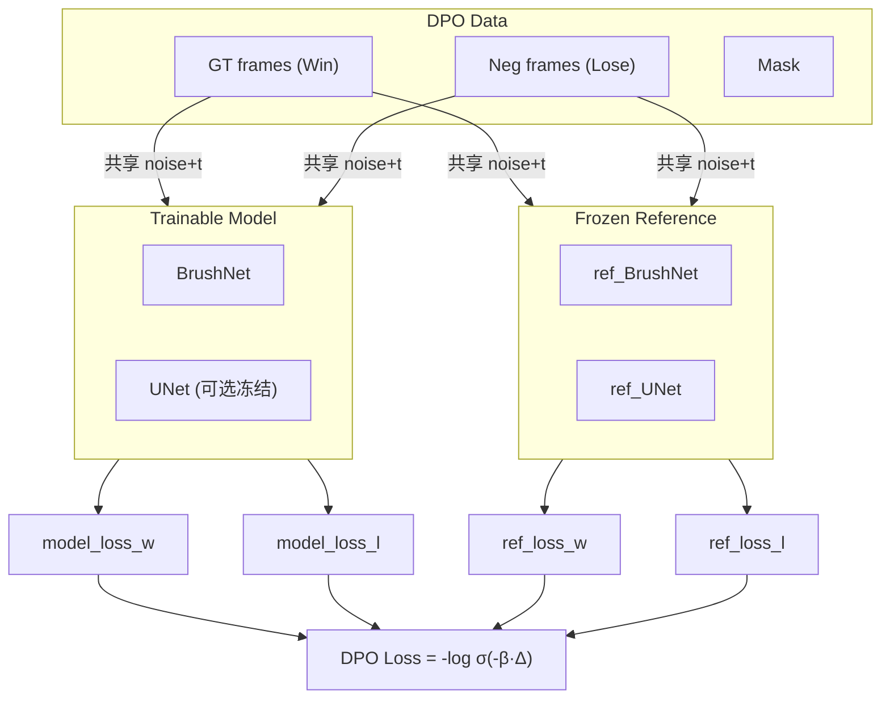

# DiffuEraser DPO Finetuning 需求文档

## 背景

将 VideoDPO 的 Diffusion-DPO loss 移植到 DiffuEraser 的 UNet+BrushNet 双分支架构中，
使用预生成的 DPO 偏好对数据（Win=GT, Lose=低质量 inpainting 结果）进行训练。

## 文件清单

| 文件 | 说明 |
|---|---|
| `training/dpo/train_DiffuEraser_dpo_stage1.py` | 主训练脚本 |
| `training/dpo/finetune_dpo_stage1.sh` | 启动脚本 |
| `training/dpo/save_checkpoint_dpo.py` | 权重导出工具 |
| `training/dataset/dpo_dataset.py` | 数据集（已修复路径问题） |
| `training/dataset/region_mask_utils.py` | 三区 mask 分解工具（已有） |

## 核心架构



## DPO Loss 公式

```
model_diff = model_loss_w - model_loss_l
ref_diff   = ref_loss_w   - ref_loss_l
Δ          = model_diff   - ref_diff
loss       = -log σ(-0.5 * β * Δ)
```

## 关键参数

| 参数 | 默认值 | 说明 |
|---|---|---|
| `beta_dpo` | 5000 | DPO 温度系数 |
| `freeze_unet` | True | 冻结 UNet 只训 BrushNet（节省显存） |
| `use_8bit_adam` | True | 8-bit Adam 减少显存 |
| `nframes` | 24 | 每个 clip 帧数 |
| `learning_rate` | 1e-6 | 学习率 |

## 运行方式

```bash
cd /home/hj/DiffuEraser_Project/training/dpo
bash finetune_dpo_stage1.sh
```
