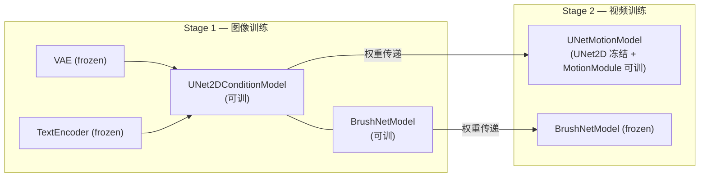
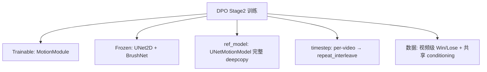

# DiffuEraser DPO 集成：问题分析报告 & 修改建议

> **日期**: 2026-03-07  
> **范围**: `train_DiffuEraser_dpo_stage1.py` 与 VideoDPO 框架的适配问题

---

## 1. 背景概览

### 1.1 DiffuEraser 两阶段训练架构



| 阶段 | 训练对象 | 数据维度 | timesteps 策略 |
|------|---------|---------|--------------|
| Stage 1 | UNet2D + BrushNet | `(B*F, C, H, W)` — 帧独立 | 每帧独立 `randint(0, T, (B*F,))` |
| Stage 2 | MotionModule only | `(B*F, C, H, W)` — 帧共享 timestep | 每视频一个 `t`，`repeat_interleave(F)` |

### 1.2 VideoDPO 的 DPO Loss 实现

VideoDPO 基于 **VideoCrafter2**（一个原生视频扩散模型），其核心做法：

1. **Win + Lose 拼接成 batch**：将 win 和 lose 样本沿 batch 维度拼接 (`torch.cat([win, lose], dim=0)`)
2. 单次 forward → 单次 ref forward → `chunk(2)` 分离 win/lose loss
3. `dpo_loss = -logsigmoid(-0.5 * β * (model_diff - ref_diff))`
4. **ref_model 是模型自身的 deepcopy**（完整含 temporal attention 的 3D UNet）

### 1.3 用户当前 DPO Stage 1 代码现状

在 [train_DiffuEraser_dpo_stage1.py](file:///home/hj/DiffuEraser_Project/training/dpo/train_DiffuEraser_dpo_stage1.py) 中：
- 对 **UNet2D** 做 DPO 训练（冻结 BrushNet）
- ref_model = `copy.deepcopy(unet)` + `copy.deepcopy(brushnet)`
- 4 次独立 forward（model_win, model_lose, ref_win, ref_lose）
- DPO loss 公式与 VideoDPO 一致

---

## 2. 核心问题诊断

### 问题 P1：Timestep 广播机制与 Baseline Stage1 不一致 ⚠️

**现象**：用户 DPO 代码中 timestep 生成为 `(B,)` 形状，但传入 `_forward_single` 时直接传给 BrushNet/UNet，而这两个模型期望的 timestep 维度是 `(B*F,)`。

**Baseline Stage1** 的做法（[train_DiffuEraser_stage1.py:901](file:///home/hj/DiffuEraser_Project/training/baseline/train_DiffuEraser_stage1.py#L901)）：
```python
bsz = latents.shape[0] // args.nframes  # latents: (B*F, C, H, W)
timesteps = torch.randint(0, T, (bsz,), device=...)  # (B,)
```
然后 `noise_scheduler.add_noise(latents, noise, timesteps)` 内部通过 `extract_into_tensor` 会根据 shape 自动广播 — **每帧共享同一个 timestep**。

**用户 DPO 代码**的做法：
```python
timesteps = torch.randint(0, T, (B,), device=...)  # (B,)
# 然后直接传给 add_noise(latents, noise, timesteps)
# 但 latents shape = (B*F, C, H, W)
```
这里 `add_noise` 会尝试用 `timesteps` 索引 `sqrt_alphas_cumprod`，但 `timesteps` 是 `(B,)` 而 `latents` 是 `(B*F, ...)`，**维度不匹配会报错或产生错误的广播**。

**严重度**: 🔴 **致命 — 会导致运行时错误或静默的语义错误**

---

### 问题 P2：SDv1.5 是图像模型，DPO 训练的理论适用性 ⚠️

**核心矛盾**：VideoDPO 论文中的 DPO 是在 **视频扩散模型** 上做的（VideoCrafter2 包含 temporal attention），而 DiffuEraser Stage1 本质上是 **图像扩散模型**（UNet2D，没有 temporal attention），每帧独立处理。

**影响分析**：

| 维度 | VideoDPO | DiffuEraser Stage1 DPO |
|------|---------|----------------------|
| 模型类型 | 原生 3D UNet（含 temporal attn） | 2D UNet + BrushNet（无 temporal） |
| 帧间一致性 | 模型内在建模 | 完全没有建模 |
| DPO 优化目标 | 偏好时序一致+视觉质量 | **只能优化单帧视觉质量** |
| 数据组织 | Win/Lose 是整段视频 | Win/Lose 也是视频帧序列，但逐帧处理 |

**结论**：**这不是一个 bug，而是一个架构设计问题。** Stage1 DPO 在理论上 **可以 work**，但它只能优化每帧的图像质量（如减少模糊、错误纹理），**无法优化时序一致性**（如减少 flicker）。如果负样本的主要问题是 flicker，那 Stage1 DPO 的效果会很有限。

**严重度**: 🟡 **需要认知对齐 — 可行但预期效果需要调整**

---

### 问题 P3：4 次独立 Forward 的 VRAM 开销问题

当前代码对每个 batch 执行 **4 次完整的 VAE encode + BrushNet forward + UNet forward**：
1. model forward on win
2. model forward on lose
3. ref forward on win
4. ref forward on lose

每次 forward 都会创建大量中间激活。即使使用 `torch.cuda.empty_cache()`，**峰值 VRAM 仍然是 4 倍于 baseline**。

**对比 VideoDPO 的做法**：
- Win/Lose 拼成一个 batch → 只需 **2 次** forward（model + ref）
- ref_model 是一个独立的 DiffusionWrapper，但共享相同的 conditioning pipeline

**严重度**: 🟠 **严重性能问题 — 可能导致 OOM**

---

### 问题 P4：DPO Stage2 缺失 — 但这才是真正需要 DPO 的阶段

**Stage2** 训练 MotionModule，负责时序一致性。如果 DPO 的核心目标是提升视频修补的时序质量（减少 flicker、improper motion），那 **DPO 应该应用在 Stage2**。

但 Stage2 的架构更复杂：
- UNetMotionModel = UNet2D (frozen) + MotionModule (trainable)
- BrushNet 仍然是 2D 的，frozen
- timestep 是 per-video（每个视频一个 t，repeat_interleave 到所有帧）

这意味着在 Stage2 做 DPO 时，ref_model 需要是 **完整的 UNetMotionModel**，而不仅仅是 UNet2D。

**严重度**: 🟡 **架构规划问题 — 当前不阻塞但影响最终效果**

---

### 问题 P5：`noise` 的 dtype 与模型精度不匹配

```python
noise = torch.randn(latent_shape, device=..., dtype=weight_dtype)
```

`weight_dtype` 通常是 `bf16/fp16`，但 `noise` 参与梯度计算时应该是 `float32`（在 mixed precision 下，master weights 和 noise target 应为 fp32）。在 `_forward_single` 内部，`pixel_values` 和 `cond_pixel_values` 被转为 `weight_dtype`，但 `noise` 本身也是 `weight_dtype`，导致 **target noise 是半精度的**，这在 MSE loss 计算时会损失精度。

**Baseline 的做法**：`noise = torch.randn_like(latents)`，其中 `latents` 经过 VAE encode 后是 `weight_dtype`，但 loss 计算时使用 `.float()` 转回 fp32。

**严重度**: 🟡 **精度问题 — 可能通过 `.float()` 转换已被部分缓解**

---

### 问题 P6：`conditioning_pos` 与 `conditioning_neg` 的混淆

在当前 DPO dataset 和训练代码中：
- `conditioning_pos` = GT 帧被 mask 遮挡后的图像
- `conditioning_neg` = 负样本帧被 mask 遮挡后的图像

但在 **Video Inpainting** 的语义下，conditioning 应该是 **相同的** — 因为对于同一个修补任务，输入条件（masked video + mask）是固定的，只有输出（GT vs 低质量修补）不同。

**正确逻辑**: Win 和 Lose 的 conditioning（masked image + mask）应该完全相同，因为：
- 我们比较的是：给定同一个修补任务（同一个 mask + 同一个被遮挡的原始视频），模型是否能更偏好 GT 而非低质量结果
- 如果 conditioning 不同，DPO 学到的偏好会被 conditioning 差异所污染

**严重度**: 🔴 **语义错误 — DPO 偏好信号被 conditioning 差异污染**

---

## 3. 修改建议 (Prioritized)

### 建议 M1：修复 Timestep 广播 [P1, 优先级: 🔴 CRITICAL]

```diff
 # 方案 A: 与 Stage1 baseline 一致，让 add_noise 内部广播
-timesteps = torch.randint(0, T, (B,), device=...).long()
+timesteps = torch.randint(0, T, (B,), device=...).long()
+# 在 _forward_single 中传给 add_noise 前 repeat_interleave
+timesteps_expanded = timesteps.repeat_interleave(nframes)
 noisy_latents = noise_scheduler.add_noise(latents, noise, timesteps_expanded)
```

同时需要确保 BrushNet 和 UNet 接收到与 `noisy_latents` batch 维度一致的 timesteps：
```python
# BrushNet/UNet 也应使用 timesteps_expanded
brushnet(noisy_latents, timesteps_expanded, ...)
unet(noisy_latents, timesteps_expanded, ...)
```

---

### 建议 M2：统一 Conditioning [P6, 优先级: 🔴 CRITICAL]

1. **修改 DPO Dataset**：只生成一份 conditioning（使用 GT 帧被 mask 遮挡后的图像）
2. **训练循环**：Win 和 Lose 共享同一份 `conditioning_pixel_values` 和同一份 `masks`

```diff
 # collate_fn 简化
 return {
     "pixel_values_pos": ...,   # Win = GT
     "pixel_values_neg": ...,   # Lose = 低质量结果
-    "conditioning_pos": ...,
-    "conditioning_neg": ...,
+    "conditioning": ...,       # 统一使用 GT masked 图像作为条件
     "masks": ...,
     "input_ids": ...,
 }
```

---

### 建议 M3：合并 Win/Lose 为单次 Forward（VRAM 优化）[P3, 优先级: 🟠 HIGH]

参考 VideoDPO 的做法，将 win/lose 拼接成一个 batch：

```python
# 拼接 win + lose
pixel_all = torch.cat([pos_pixels, neg_pixels], dim=0)  # [2B, F, C, H, W]
cond_all = torch.cat([cond, cond], dim=0)  # conditioning 相同，重复一次
masks_all = torch.cat([masks, masks], dim=0)

# 共享 noise & timestep
noise_all = noise.repeat(2, 1, 1, 1)
timesteps_all = timesteps.repeat(2)

# 单次 forward
model_loss_all = _forward_single(unet, brushnet, ...)  # [2B*F]
model_loss_w, model_loss_l = model_loss_all.chunk(2)    # 各 [B*F]

# ref 同理
ref_loss_all = _forward_single(ref_unet, ref_brushnet, ...)
ref_loss_w, ref_loss_l = ref_loss_all.chunk(2)
```

**效果**：Forward 次数从 4→2，VRAM 峰值降低约 40%。

---

### 建议 M4：Noise 精度修复 [P5, 优先级: 🟡 MEDIUM]

```diff
-noise = torch.randn(latent_shape, device=..., dtype=weight_dtype)
+noise = torch.randn(latent_shape, device=..., dtype=torch.float32)
```

让 noise 始终为 fp32，与 mixed precision 训练的最佳实践一致。在 `_forward_single` 内部，VAE encode 结果已经是 `weight_dtype`，noise 在 `add_noise` 时会自动转型。

---

### 建议 M5：Stage1 DPO 的训练策略调整 [P2, 优先级: 🟡 MEDIUM]

**认知对齐**：Stage1 DPO **可以 work**，但效果仅限于 **单帧图像质量** 的偏好对齐。需要：

1. **明确负样本的分类**：区分负样本的问题类型
   - `blur` / `hallucination` → Stage1 DPO 有效
   - `flicker` / `temporal inconsistency` → Stage1 DPO 无效，需要 Stage2 DPO
2. **建议 Stage1 DPO 只使用图像质量类的负样本**
3. **长期方案**：开发 Stage2 DPO，在 MotionModule 上做偏好对齐

---

### 建议 M6：Stage2 DPO 的架构预设计 [P4, 优先级: 🟡 MEDIUM-LOW]

如果后续要在 Stage2 做 DPO：



关键差异点：
- `ref_model` 需要是完整的 `UNetMotionModel`（含 MotionModule）
- 只训练 MotionModule 参数，但 DPO loss 通过完整模型计算
- timestep 必须用 `repeat_interleave` 保持帧间一致

---

## 4. 优先修改路线图

```mermaid
gantt
    title DPO 修改路线图
    dateFormat  X
    axisFormat %s
    section P0 Critical Fixes
    M1 修复 Timestep 广播           :crit, m1, 0, 1
    M2 统一 Conditioning            :crit, m2, 0, 1
    section P1 HIGH
    M3 合并 Forward (VRAM)          :m3, 1, 2
    M4 Noise 精度修复               :m4, 1, 2
    section P2 MEDIUM
    M5 负样本策略调整               :m5, 2, 3
    section Future
    M6 Stage2 DPO 设计              :m6, 3, 4
```



| 优先级 | 修改项 | 影响范围 | 预计工时 |
|-------|--------|---------|---------|
| 🔴 P0 | M1 Timestep 修复 | `_forward_single()` | 0.5h |
| 🔴 P0 | M2 统一 Conditioning | `dpo_dataset.py` + `collate_fn` + training loop | 1h |
| 🟠 P1 | M3 合并 Forward (2x) | training loop 重构 | 2h |
| 🟡 P2 | M4 Noise 精度 | 1 行修改 | 0.1h |
| 🟡 P2 | M5 负样本策略 | 数据层面，无代码修改 | 讨论 |
| 🟡 P3 | M6 Stage2 DPO | 新文件 | 未来 |

---

## 5. 与 VideoDPO 的关键差异总结

| 维度 | VideoDPO | DiffuEraser DPO (当前) | DiffuEraser DPO (修复后) |
|------|---------|----------------------|------------------------|
| 基底模型 | VideoCrafter2 (3D UNet) | SDv1.5 UNet2D | SDv1.5 UNet2D |
| 条件控制 | Text → CrossAttn | Text + BrushNet (mask+image) | 同左 |
| Win/Lose batch | `cat → chunk(2)` | 4x forward | **`cat → chunk(2)` (M3)** |
| Timestep | per-video | ⚠️ `(B,)` 维度不匹配 | **`repeat_interleave(F)` (M1)** |
| Conditioning | 相同 text prompt | ⚠️ 不同 conditioning | **统一 conditioning (M2)** |
| ref_model | 模型内部 deepcopy | 独立 deepcopy ✅ | 同左 |
| 训练框架 | PyTorch Lightning | HF Accelerate ✅ | 同左 |
| DPO loss | `dpo_loss()` | 自定义实现 ✅ | 同左 |

> **✅** = 当前实现正确，**⚠️** = 需要修复
