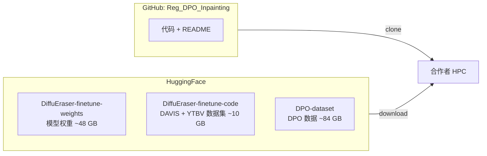
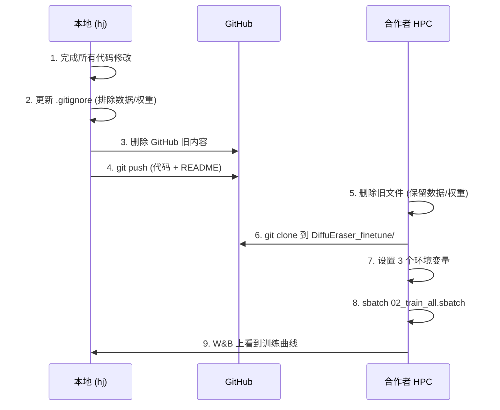
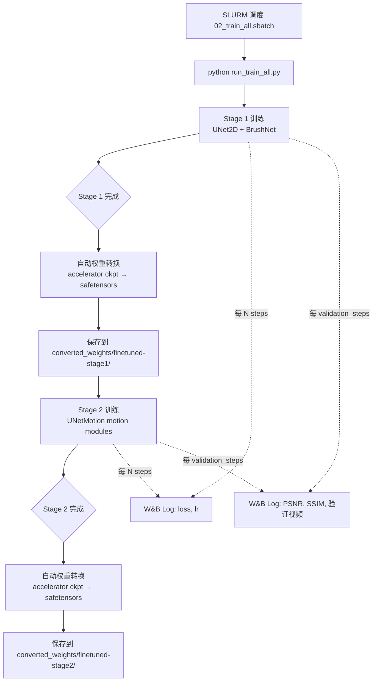
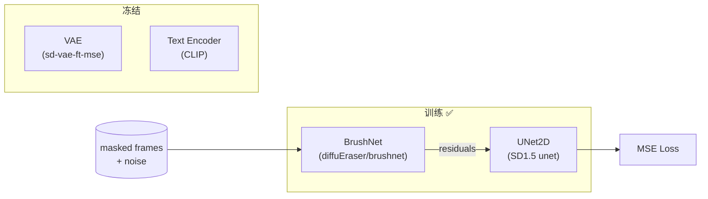
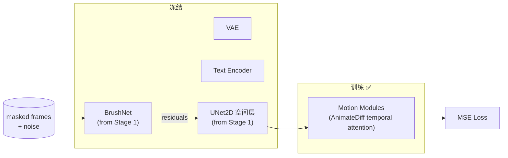
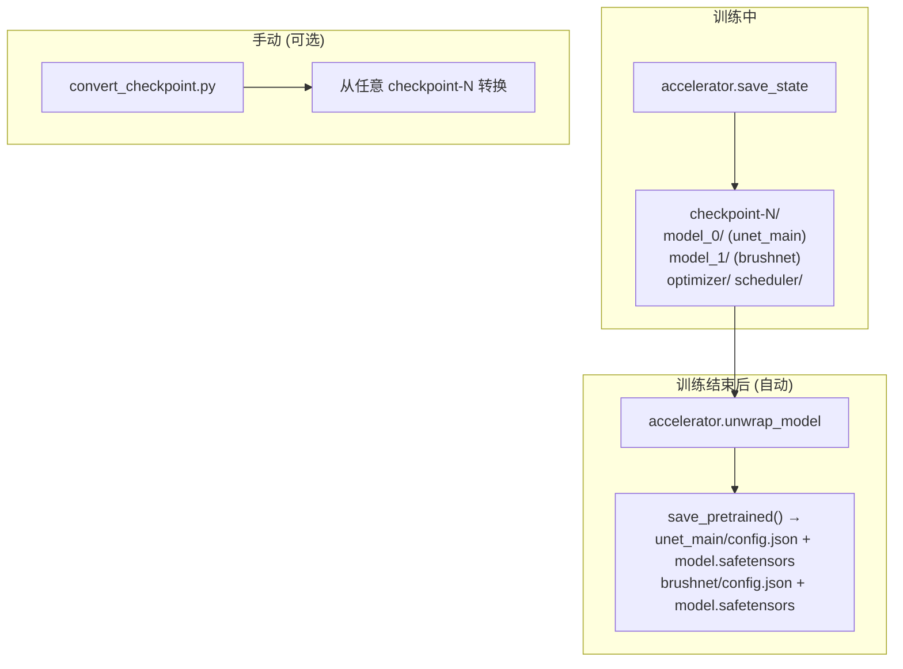
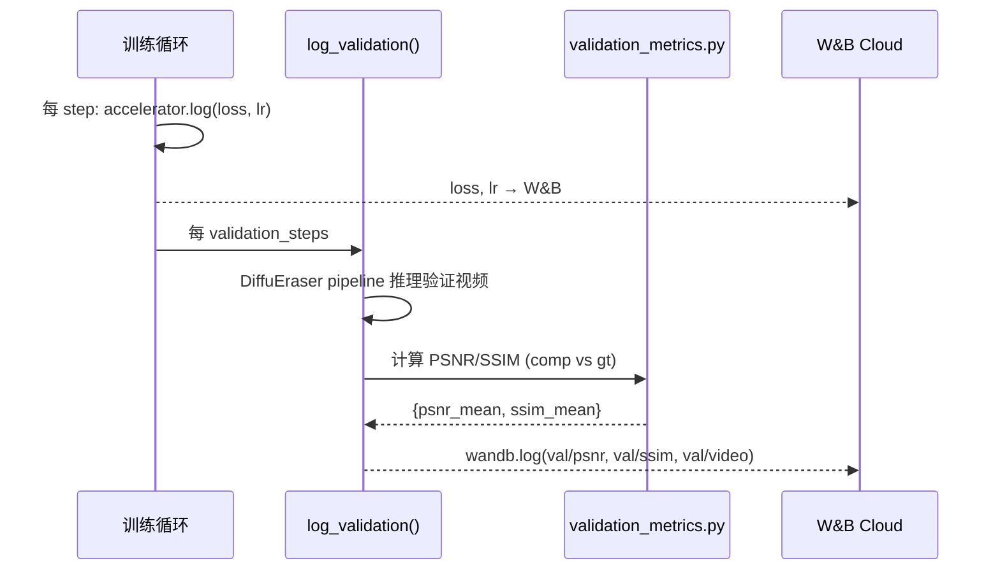

# DiffuEraser Finetune 管线重构 — 完整设计文档

> **目标**：将现有 `DiffuEraser_finetune` 项目从 "HuggingFace all-in-one" 模式迁移至 **GitHub (代码) + HuggingFace (数据 & 权重)** 的标准科研协作架构，同时修复已知 Bug、整合 W&B 监控、简化脚本逻辑。

---

## 1. 现状分析

### 1.1 当前仓库结构 (HuggingFace)

```
DiffuEraser_finetune/
├── train_DiffuEraser_stage1.py     # Stage 1 训练（UNet2D + BrushNet）
├── train_DiffuEraser_stage2.py     # Stage 2 训练（UNetMotionModel motion modules）
├── save_checkpoint_stage1.py       # 独立权重转换脚本 (accelerator → safetensors)
├── save_checkpoint_stage2.py       # 独立权重转换脚本 (accelerator → safetensors)
├── run_finetune_all.sbatch         # 一键训练 SLURM 脚本 (含权重转换逻辑)
├── score_inpainting_quality.py     # 质量评分脚本
├── smoke_test_stage2.sh            # Stage2 冒烟测试
├── README.md                       # 合作者操作指南
├── .gitignore
├── environment.yml / requirements.txt
├── diffueraser/                    # 模型核心 (pipeline, metrics, etc.)
├── libs/                           # 自定义 UNet/BrushNet/MotionAdapter
├── inference/                      # 推理 & 评估 (compare_all.py, metrics.py, etc.)
├── log/                            # 训练日志
├── PRD/                            # 需求文档
├── weights -> (symlink)            # 模型权重 (已 .gitignore)
└── data -> (symlink)               # 数据集 (已 .gitignore)
```

### 1.2 已识别的问题

| #  | 问题 | 严重程度 | 详细说明 |
|----|------|---------|---------|
| 1  | **Stage 1 末尾 Bug** | 🔴 Critical | `train_DiffuEraser_stage1.py` L1024 调用 `unet_main.save_motion_modules()`，但 Stage 1 的 `unet_main` 是 `UNet2DConditionModel`，**没有 `save_motion_modules` 方法**，训练完成后必然报 `AttributeError` |
| 2  | **SLURM 脚本混杂逻辑** | 🟡 Design | `run_finetune_all.sbatch` 和 README 中内嵌的 `.sbatch` 里包含 `sed / cp / python` 权重转换逻辑，违反「SLURM 只当 Python 运行机器」原则 |
| 3  | **权重转换独立文件冗余** | 🟡 Design | `save_checkpoint_stage1.py` 和 `save_checkpoint_stage2.py` 需要手动替换路径(`checkpoint-xxxx`)，SLURM 脚本用 `sed` hack 来自动化——脆弱且不优雅 |
| 4  | **硬编码路径** | 🟡 Portability | 多处硬编码 `/home/hj/...` 路径，合作者无法直接使用 |
| 5  | **缺少 W&B 集成** | 🟡 Feature | 训练中 `accelerator.init_trackers()` 被注释掉，无法远程监控训练过程 |
| 6  | **验证缺少定量指标** | 🟡 Feature | 训练中 validation 只做定性可视化（保存视频），无 PSNR/SSIM 等定量指标 |
| 7  | **Stage 2 末尾不保存 BrushNet** | 🟡 Bug | `train_DiffuEraser_stage2.py` L989-994 只保存 motion modules，不保存 BrushNet（Stage 2 中 BrushNet 冻结所以影响较小，但转换时仍需 BrushNet） |
| 8  | **环境变量不统一** | 🟡 Usability | 需要 3 个环境变量 (`HF_TOKEN`, `WANDB_API_KEY`, `PROJECT_HOME`)，但 README 中 `WANDB_API_KEY` 未涵盖 |

---

## 2. 目标架构

### 2.1 仓库分离策略



### 2.2 合作者工作目录布局

```
$PROJECT_HOME/dev/DiffuEraser_finetune/    ← 所有文件直接在此目录下
├── train_DiffuEraser_stage1.py
├── train_DiffuEraser_stage2.py
├── convert_checkpoint.py                  ← [NEW] 统一权重转换 (替代 save_checkpoint_stage1/2.py)
├── run_train_stage1.py                    ← [NEW] Stage 1 训练入口 (python 脚本)
├── run_train_stage2.py                    ← [NEW] Stage 2 训练入口 (python 脚本)
├── run_train_all.py                       ← [NEW] 一键 Stage 1 + Stage 2 训练 (python 脚本)
├── validation_metrics.py                  ← [NEW] 训练中 validation 精简 metric 计算
├── 01_setup.sbatch                        ← SLURM: 环境搭建 (只调用 python)
├── 02_train_stage1.sbatch                 ← SLURM: 只调用 python run_train_stage1.py
├── 02_train_stage2.sbatch                 ← SLURM: 只调用 python run_train_stage2.py
├── 02_train_all.sbatch                    ← SLURM: 只调用 python run_train_all.py
├── README.md
├── environment.yml / requirements.txt
├── .gitignore
├── diffueraser/
├── libs/
├── inference/
├── dataset/                               ← 从 HF 下载 (gitignored)
│   ├── DAVIS/
│   └── YTBV/
├── weights/                               ← 从 HF 下载 (gitignored)
│   ├── stable-diffusion-v1-5/
│   ├── diffuEraser/
│   ├── sd-vae-ft-mse/
│   └── animatediff-motion-adapter-v1-5-2/
├── finetune-stage1/                       ← 训练输出 (gitignored)
├── finetune-stage2/                       ← 训练输出 (gitignored)
└── converted_weights/                     ← 转换后权重 (gitignored)
```

### 2.3 三个环境变量

| 环境变量 | 用途 | 示例 |
|---------|------|------|
| `PROJECT_HOME` | 合作者根路径 | `/sc-projects/sc-proj-cc09-repair/hongyou` |
| `HF_TOKEN` | HuggingFace 下载凭证 | `hf_xxxxxxxxxxxxxxxxx` |
| `WANDB_API_KEY` | W&B 远程监控 Key | `xxxxxxxxxxxxxxxxxxxxxxxxxxxxxxxxxxxxxxxx` |

---

## 3. 各项改造详细方案

### 3.1 修复 Stage 1 训练末尾 Bug

**问题根因**：`train_DiffuEraser_stage1.py` L1019-1028 在训练结束后执行：

```python
unet_main = accelerator.unwrap_model(unet_main)
unet_main.save_motion_modules(args.output_dir)  # ← BUG: UNet2DConditionModel 没有此方法

brushnet = accelerator.unwrap_model(brushnet)
brushnet.save_pretrained(args.output_dir)
```

Stage 1 的 `unet_main` 是 `UNet2DConditionModel`（不含 motion modules），调用 `save_motion_modules()` 会直接 `AttributeError`。

**修复方案**：将末尾保存逻辑改为：

```python
# Stage 1: 保存 UNet2D + BrushNet
unet_main = accelerator.unwrap_model(unet_main)
unet_main.save_pretrained(os.path.join(args.output_dir, "unet_main"))

brushnet = accelerator.unwrap_model(brushnet)
brushnet.save_pretrained(os.path.join(args.output_dir, "brushnet"))
```

同时在保存 `accelerator.save_state()` 之后紧接着执行权重转换（见 3.3 节）。

### 3.2 修复 Stage 2 训练末尾保存逻辑

**当前行为**：`train_DiffuEraser_stage2.py` L987-994 只保存 motion modules：

```python
unet_main = accelerator.unwrap_model(unet_main)
unet_main.save_motion_modules(args.output_dir)
# BrushNet 未保存！
```

**修复方案**：将末尾保存逻辑改为：

```python
# Stage 2: 保存 UNetMotionModel + BrushNet
unet_main = accelerator.unwrap_model(unet_main)
unet_main.save_pretrained(os.path.join(args.output_dir, "unet_main"))

brushnet = accelerator.unwrap_model(brushnet)
brushnet.save_pretrained(os.path.join(args.output_dir, "brushnet"))
```

### 3.3 权重转换逻辑内嵌至训练脚本

**现状**：训练完成后需要手动运行 `save_checkpoint_stage1.py` / `save_checkpoint_stage2.py`，或在 SLURM 中用 `sed` hack 自动化。

**改造方案**：将权重转换逻辑直接嵌入训练脚本末尾。训练结束时（`max_train_steps` 达到后），自动执行：

1. `accelerator.save_state(final_checkpoint_path)` — 保存完整 checkpoint（已有逻辑）
2. 紧接着从该 checkpoint 加载并导出为 `unet_main/config.json + model.safetensors` 和 `brushnet/config.json + model.safetensors`

**具体流程** (以 Stage 1 为例)：

```python
# 训练循环结束后...
accelerator.wait_for_everyone()
if accelerator.is_main_process:
    # 1. 常规保存（accelerator checkpoint）— 已在循环内完成
    # 2. 导出推理友好的权重
    unet_unwrapped = accelerator.unwrap_model(unet_main)
    brushnet_unwrapped = accelerator.unwrap_model(brushnet)

    converted_dir = os.path.join(args.output_dir, "converted_weights")
    unet_unwrapped.save_pretrained(os.path.join(converted_dir, "unet_main"))
    brushnet_unwrapped.save_pretrained(os.path.join(converted_dir, "brushnet"))

    logger.info(f"Converted weights saved to {converted_dir}")
```

Stage 2 同理，但 `unet_main` 是 `UNetMotionModel`。

同时保留一个独立的 `convert_checkpoint.py` 脚本（合并 `save_checkpoint_stage1.py` 和 `save_checkpoint_stage2.py`），用于从任意历史 checkpoint 手动转换权重（用 argparse 传参，无需 `sed`）：

```bash
python convert_checkpoint.py \
  --stage 1 \
  --checkpoint_dir finetune-stage1/checkpoint-50000 \
  --base_model_path weights/stable-diffusion-v1-5 \
  --brushnet_path weights/diffuEraser \
  --output_dir converted_weights/finetuned-stage1
```

### 3.4 SLURM 脚本纯化

**原则**：SLURM 脚本 **只做** 环境激活 + 调用 Python 脚本，不处理任何业务逻辑。

**`02_train_stage1.sbatch`**（改造后）:

```bash
#!/bin/bash
#SBATCH --job-name=DiffuEraser_Stage1
#SBATCH --partition=gpu
#SBATCH --gres=gpu:1
#SBATCH --cpus-per-task=16
#SBATCH --mem=200G
#SBATCH --time=48:00:00
#SBATCH --output=logs/train-stage1-%j.out

source ~/.bashrc
conda activate diffueraser
cd "${PROJECT_HOME}/dev/DiffuEraser_finetune"

python run_train_stage1.py --num_gpus ${1:-1}
```

所有训练参数、路径解析、权重转换均在 `run_train_stage1.py` 中处理。

### 3.5 Python 训练入口脚本设计

#### 3.5.1 `run_train_stage1.py` (分开训练模式)

```python
"""
Stage 1 训练入口：
1. 解析 $PROJECT_HOME 环境变量，推导所有路径
2. 调用 accelerate launch → train_DiffuEraser_stage1.py
3. 训练完成后权重已自动转换 (内嵌在训练脚本末尾)
"""
```

核心流程：
- 从 `$PROJECT_HOME` 推导 `WORK_DIR`, `WEIGHTS`, `DAVIS`, `YTBV` 路径  
- 组装 `accelerate launch` 命令并 `subprocess.run()`
- `--report_to wandb` + `--wandb_project DPO_Diffueraser`

#### 3.5.2 `run_train_stage2.py` (分开训练模式)

与 `run_train_stage1.py` 同理，额外需要：
- `--pretrained_stage1` 指向 Stage 1 转换后的权重
- `--motion_adapter_path` 指向 MotionAdapter

#### 3.5.3 `run_train_all.py` (一键训练模式)

```python
"""
一键 Stage 1 + Stage 2：
1. 运行 Stage 1 (调用 run_train_stage1.py 的核心函数)
2. Stage 1 完成后自动进入 Stage 2 (调用 run_train_stage2.py 的核心函数)
"""
```

#### 3.5.4 两组脚本对照

| 脚本 | 功能 | SLURM 调用方式 |
|------|------|---------------|
| `run_train_stage1.py` | 只训练 Stage 1 | `sbatch 02_train_stage1.sbatch` |
| `run_train_stage2.py` | 只训练 Stage 2 | `sbatch 02_train_stage2.sbatch` |
| `run_train_all.py` | 一键 Stage 1 → Stage 2 | `sbatch 02_train_all.sbatch` |

### 3.6 路径环境变量化

**所有硬编码路径替换为基于 `$PROJECT_HOME` 的相对路径推导**：

```python
import os
PROJECT_HOME = os.environ.get("PROJECT_HOME")
if not PROJECT_HOME:
    raise EnvironmentError("请设置 PROJECT_HOME 环境变量")

WORK_DIR = os.path.join(PROJECT_HOME, "dev", "DiffuEraser_finetune")
WEIGHTS  = os.path.join(WORK_DIR, "weights")
DAVIS    = os.path.join(WORK_DIR, "dataset", "DAVIS")
YTBV     = os.path.join(WORK_DIR, "dataset", "YTBV")
```

同样适用于 `inference/metrics.py` 和 `inference/compare_all.py` 中的硬编码路径（如 `/home/hj/VBench`、`/home/hj/DiffuEraser1/weights/...`）。

### 3.7 W&B 集成方案

#### 3.7.1 训练脚本中的 W&B 配置

在 `train_DiffuEraser_stage1.py` 和 `train_DiffuEraser_stage2.py` 中：

1. **启用 `accelerator.init_trackers()`**（目前被注释掉）：

```python
if accelerator.is_main_process:
    tracker_config = dict(vars(args))
    tracker_config.pop("validation_prompt")
    tracker_config.pop("validation_image")
    tracker_config.pop("validation_mask")
    accelerator.init_trackers(
        project_name=args.wandb_project or "DPO_Diffueraser",
        config=tracker_config,
        init_kwargs={"wandb": {"entity": args.wandb_entity or None}}
    )
```

2. **训练循环中已有 `accelerator.log()` 记录 loss 和 lr**（L1012-1014），只需将 `--report_to` 改为 `wandb` 即可自动上传。

3. **新增参数**:
   - `--wandb_project` (default: `"DPO_Diffueraser"`)
   - `--wandb_entity` (default: `None`)
   - `--report_to` 默认值从 `"tensorboard"` 改为 `"wandb"`

#### 3.7.2 Validation 中添加定量指标

在 `log_validation()` 函数返回验证视频后，使用精简版 `validation_metrics.py` 计算 PSNR / SSIM，并通过 `wandb.log()` 上传：

```python
# 在 validation 中
if metrics_results:
    wandb.log({
        "val/psnr": metrics_results["psnr_mean"],
        "val/ssim": metrics_results["ssim_mean"],
    }, step=global_step)
```

#### 3.7.3 `validation_metrics.py` 精简版

从 `inference/compare_all.py` + `inference/metrics.py` 中提取**最小集**：

- **保留**：PSNR、SSIM 计算（纯 numpy/skimage，无额外 GPU 模型）
- **移除**：LPIPS、VBench、VFID、IS、AS、I3D、RAFT（这些需加载大量预训练模型，不适合在训练中频繁调用）
- **移除**：视频合成、比较视频生成、ProPainter/DiffuEraser 推理等

输出格式保持精美：

```
  ─────────────────────────────────────
  Validation Metrics @ Step 2000
  ─────────────────────────────────────
   Video       PSNR ↑     SSIM ↑
  ─────────────────────────────────────
   bear       28.4321     0.9234
   boat       26.1234     0.8901
  ─────────────────────────────────────
   Average    27.2778     0.9068
  ─────────────────────────────────────
```

### 3.8 `.gitignore` 更新

在现有基础上补充：

```gitignore
# === 训练输出 ===
finetune-stage1/
finetune-stage2/
converted_weights/
logs-finetune-*/

# === 训练日志 ===
logs/
log/

# === W&B ===
wandb/

# === 下载缓存 ===
DiffuEraser_downloads/
```

### 3.9 GitHub 推送流程



详细操作步骤：

```bash
cd /home/hj/DiffuEraser_finetune

git remote set-url origin https://github.com/jh5117-debug/Reg_DPO_Inpainting.git

git rm -r --cached .
git add .
git commit -m "refactor: clean codebase for GitHub (code only, no data/weights)"
git push --force origin main
```

合作者侧：

```bash
cd /sc-projects/sc-proj-cc09-repair/hongyou/dev/DiffuEraser_finetune
find . -maxdepth 1 ! -name 'dataset' ! -name 'weights' ! -name '.' -exec rm -rf {} +
git clone https://github.com/jh5117-debug/Reg_DPO_Inpainting.git .
```

---

## 4. 完整训练流程 (合作者视角)

### 4.0 前置：环境变量 & 环境安装

```bash
export PROJECT_HOME="/sc-projects/sc-proj-cc09-repair/hongyou"
export HF_TOKEN="hf_xxxxxxxxxxxxxxxxx"
export WANDB_API_KEY="xxxxxxxxxxxxxxxxxxxxxxxxxxxxxxxxxxxxxxxx"

conda activate diffueraser
pip install wandb weave
wandb login
```

### 4.1 一键训练模式

```bash
cd ${PROJECT_HOME}/dev/DiffuEraser_finetune
sbatch 02_train_all.sbatch
```

**内部流程**：



### 4.2 分开训练模式

```bash
sbatch 02_train_stage1.sbatch     # Stage 1
# 等 Stage 1 完成后...
sbatch 02_train_stage2.sbatch     # Stage 2
```

### 4.3 训练中断恢复

所有脚本均启用 `--resume_from_checkpoint="latest"`，直接重新 `sbatch` 即可从最后 checkpoint 恢复。

### 4.4 W&B 监控

训练启动后，你 (hj) 在 W&B 上可实时查看：

| 指标 | 来源 | 频率 |
|------|------|------|
| `train/loss` | `accelerator.log()` | 每 step |
| `train/lr` | `accelerator.log()` | 每 step |
| `val/psnr` | `validation_metrics.py` | 每 `validation_steps` |
| `val/ssim` | `validation_metrics.py` | 每 `validation_steps` |
| `val/video` | 保存的验证视频 | 每 `validation_steps` |

W&B Project: `jh5117-columbia-university/DPO_Diffueraser`

---

## 5. 文件变更清单

### 5.1 修改文件

| 文件 | 改动概要 |
|------|---------|
| `train_DiffuEraser_stage1.py` | ① 修复末尾 `save_motion_modules` Bug → `save_pretrained`<br>② 取消注释 `init_trackers()`，`report_to` 默认改 `wandb`<br>③ 训练结束后内嵌权重转换逻辑<br>④ validation 中增加 PSNR/SSIM 计算 + `wandb.log()`<br>⑤ 所有硬编码路径移除 |
| `train_DiffuEraser_stage2.py` | ① 末尾增加 BrushNet 保存<br>② 同 Stage 1 的 W&B 和权重转换改造<br>③ 所有硬编码路径移除 |
| `.gitignore` | 增加 `finetune-stage*/`, `converted_weights/`, `wandb/`, `logs/`, `log/` |
| `README.md` | 全面重写：GitHub clone + HF 下载 + 3 环境变量 + 新脚本名 |
| `inference/compare_all.py` | 移除硬编码路径 (`/home/hj/VBench`) |
| `inference/metrics.py` | 移除硬编码路径 (`/home/hj/DiffuEraser1/weights/...`) |

### 5.2 新增文件

| 文件 | 功能 |
|------|------|
| `run_train_stage1.py` | Stage 1 训练 Python 入口（路径推导 + accelerate launch） |
| `run_train_stage2.py` | Stage 2 训练 Python 入口 |
| `run_train_all.py` | 一键 Stage 1 + 2 Python 入口 |
| `convert_checkpoint.py` | 统一权重转换脚本（合并原 save_checkpoint_stage1/2.py） |
| `validation_metrics.py` | 精简 validation metrics (PSNR + SSIM) |
| `02_train_stage1.sbatch` | 纯 SLURM 壳 → `python run_train_stage1.py` |
| `02_train_stage2.sbatch` | 纯 SLURM 壳 → `python run_train_stage2.py` |
| `02_train_all.sbatch` | 纯 SLURM 壳 → `python run_train_all.py` |

### 5.3 删除文件

| 文件 | 原因 |
|------|------|
| `save_checkpoint_stage1.py` | 逻辑已内嵌训练脚本 + 合并到 `convert_checkpoint.py` |
| `save_checkpoint_stage2.py` | 同上 |
| `run_finetune_all.sbatch` | 逻辑已拆分至 Python 入口脚本 |
| `smoke_test_stage2.sh` | 功能由新的训练入口脚本覆盖 |

---

## 6. 训练架构技术细节

### 6.1 Stage 1：BrushNet + UNet2D 微调



- **输入**：DAVIS + YTBV 视频帧 (nframes=10)
- **输出**：`finetune-stage1/` 目录下 accelerator checkpoints
- **转换**：`converted_weights/finetuned-stage1/{unet_main, brushnet}/`

### 6.2 Stage 2：Motion Module 微调



- **输入**：DAVIS + YTBV 视频帧 (nframes=22)
- **前置**：Stage 1 转换权重 (`converted_weights/finetuned-stage1/`)
- **输出**：`finetune-stage2/` 目录下 accelerator checkpoints
- **转换**：`converted_weights/finetuned-stage2/{unet_main, brushnet}/`

### 6.3 权重转换数据流



---

## 7. W&B Validation 指标流



---

## 8. 实施次序

| 步骤 | 内容 | 依赖 |
|------|------|------|
| 1 | 修复 `train_DiffuEraser_stage1.py` 末尾 Bug | 无 |
| 2 | 修复 `train_DiffuEraser_stage2.py` 末尾保存 | 无 |
| 3 | 权重转换逻辑内嵌训练脚本 | 步骤 1, 2 |
| 4 | 创建 `convert_checkpoint.py` (统一手动转换) | 步骤 1, 2 |
| 5 | 创建 `validation_metrics.py` | 无 |
| 6 | W&B 集成 (init_trackers + wandb.log) | 步骤 5 |
| 7 | 创建 3 个 Python 训练入口脚本 | 步骤 1-6 |
| 8 | 创建 3 个纯 SLURM 壳脚本 | 步骤 7 |
| 9 | 路径环境变量化 (训练 + 推理) | 步骤 7 |
| 10 | 更新 `.gitignore` | 无 |
| 11 | 重写 `README.md` | 步骤 7-10 |
| 12 | 删除废弃文件 | 步骤 4 |
| 13 | 推送到 GitHub | 步骤 1-12 |

---

## 9. 合作者操作手册 (Quick Start)

```bash
# ========== 1. 设置环境变量 (加入 ~/.bashrc) ==========
export PROJECT_HOME="/sc-projects/sc-proj-cc09-repair/hongyou"
export HF_TOKEN="hf_xxxxxxxxxxxxxxxxx"
export WANDB_API_KEY="xxxxxxxxxxxxxxxxxxxxxxxxxxxxxxxxxxxxxxxx"

# ========== 2. Clone 代码 ==========
cd ${PROJECT_HOME}/dev/DiffuEraser_finetune
find . -maxdepth 1 ! -name 'dataset' ! -name 'weights' ! -name '.' -exec rm -rf {} +
git clone https://github.com/jh5117-debug/Reg_DPO_Inpainting.git .

# ========== 3. 安装依赖 ==========
conda activate diffueraser
pip install wandb weave
wandb login

# ========== 4. 一键训练 ==========
sbatch 02_train_all.sbatch

# ========== 5. 或分开训练 ==========
sbatch 02_train_stage1.sbatch
# 等 Stage 1 完成...
sbatch 02_train_stage2.sbatch
```

---

> **文档版本**: v1.0  
> **日期**: 2026-03-07  
> **作者**: DiffuEraser Finetune 管线重构设计
