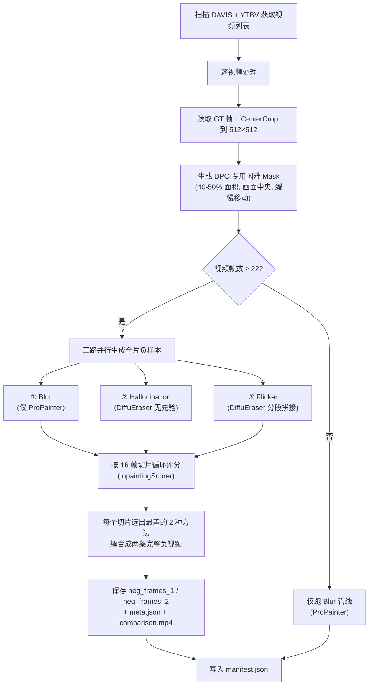
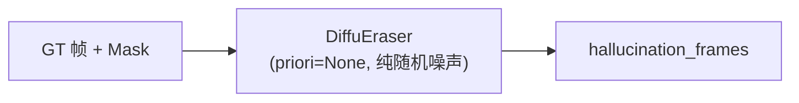
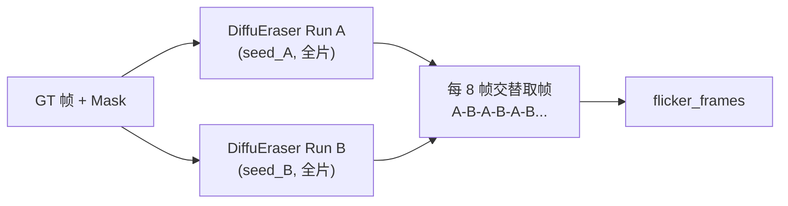

# DPO 偏好对数据集生成方案 — 详细技术文档

> **脚本**: `generate_dpo_negatives.py`  
> **运行环境**: Conda `diffueraser`, GPU (单卡)  
> **数据源**: DAVIS-2017 (60 videos) + YouTube-VOS/YTBV (1964 videos) ≈ 2024 个视频  

---

## 一、核心思想

DPO (Direct Preference Optimization) 训练需要成对的 **(正样本, 负样本)** 数据。

| 角色   | 内容                                                       |
|--------|------------------------------------------------------------|
| **正样本 (Win)** | Ground Truth 原始视频帧 — 人眼看到的"完美答案"                  |
| **负样本 (Lose)** | 由模型生成的、在 Mask 区域内质量最差的修复结果 — "最烂的答案" |

**目标**：让模型通过对比"好 vs 烂"来学习，训练后自动生成更接近正样本质量的修复结果。

---

## 二、总体流程概览



---

## 三、Mask 生成策略 (`create_dpo_hard_mask`)

### 3.1 设计动机

传统随机 Mask 存在两大问题：
1. **面积过小**：默认 1/3~全幅随机，经常生成 10% 以下的碎小 Mask，光流轻松修复
2. **位置随机**：Mask 可能贴边生成，而真实场景中主体通常在画面中央

### 3.2 约束参数

| 约束项     | 具体设定                                                        |
|------------|----------------------------------------------------------------|
| **面积**   | 宽高各占画幅的 `75%~85%`，外接矩形面积 `56%~72%`，多边形实际白色像素 `40%~50%` |
| **位置**   | 四周预留 `15%` 边缘空气墙，Mask 永远不触碰画面物理边界              |
| **运动**   | `50%` 概率完全静止；`50%` 概率以 `0.5~1.5` 像素/帧的极低速度缓慢漂移 |
| **反弹**   | 触碰空气墙时反射角反弹，始终保持在中央安全区内                      |

### 3.3 为什么这样设计

- **大面积中央遮挡** → ProPainter 的光流无法从遮挡帧的边缘像素中拼凑出足够信息，生成的修复结果会出现严重模糊和涂抹
- **缓慢移动或静止** → 移动过快反而暴露了被遮挡的背景像素，让光流轻松补齐（这是修补的好事，但不是我们制造"困难负样本"想要的效果）
- **不触碰边缘** → 模拟真实用户拍摄场景：人物/物体通常在画面中间

### 3.4 多边形形状

使用 `dataset/utils.py` 中的 `get_random_shape()` 生成 5~8 边的随机凸多边形，`ratio` 参数控制形状的不规则度（0.6~0.8），使 Mask 边界自然且不规则。

---

## 四、三种负样本生成管线

### 4.1 管线 ①：Blur（模糊退化）


| 特征       | 说明                                                         |
|------------|--------------------------------------------------------------|
| **模型**   | 仅 ProPainter（基于光流的视频修复模型）                        |
| **输入**   | GT 帧 + Mask                                                 |
| **输出**   | 全长度修复帧                                                  |
| **缺陷特征** | Mask 区域内呈现明显的**模糊涂抹**，缺乏纹理细节，边界有糊斑   |
| **适用场景** | 大面积遮挡时光流信息不足，ProPainter 只能做平滑插值            |

### 4.2 管线 ②：Hallucination（幻觉退化）



| 特征       | 说明                                                         |
|------------|--------------------------------------------------------------|
| **模型**   | 仅 DiffuEraser（DPO 变体 `diffueraser_OR_DPO.py`）           |
| **输入**   | GT 帧 + Mask，**不提供 ProPainter 先验** (`priori=None`)      |
| **输出**   | 全长度修复帧                                                  |
| **Seed**   | 单一固定 Seed，保证时序连贯                                    |
| **缺陷特征** | Mask 区域内生成**与真实背景完全无关的幻觉内容**（如凭空出现建筑物、草地等），空间上不合理 |
| **关键实现** | `diffueraser_OR_DPO.py` 中当 `priori=None` 时，跳过 VAE 编码先验，直接用 `randn_tensor` 初始化纯随机噪声作为 latents |

### 4.3 管线 ③：Flicker（时序闪烁退化 — 交错拼接策略）



| 特征       | 说明                                                         |
|------------|--------------------------------------------------------------|
| **模型**   | DiffuEraser (无先验)，运行 **2 次全片**                       |
| **输入**   | 同一个 GT + Mask，两次使用**完全不同的 Seed**                  |
| **交错步长** | 每 `8 帧` 交替切换来源 (A→B→A→B→...)                         |
| **Seed 偏移** | Run A: `base_seed + 7`, Run B: `base_seed + 1007`           |
| **输出**   | 密集交错拼接：82 帧中有 ~10 个闪烁切点                        |
| **缺陷特征** | 每隔 8 帧出现**背景风格剧变和闪烁**，所有 16 帧窗口必含闪烁    |
| **计算量**  | 与旧方案完全相同（2 次 DiffuEraser 推理），但闪烁覆盖率从 20% 提升至 100% |

> **设计关键**：旧方案仅在 `mid` 帧处有 1 个闪烁点，80% 的 16 帧评分窗口不含闪烁。
> 交错策略利用已有的 2 次推理结果，通过组装阶段的交替取帧，零额外算力地将闪烁密度提升了 10 倍。

---

## 五、按 16 帧切片评分与缝合策略

### 5.1 设计动机

如果对整个 82 帧视频算一个全局平均分，会产生"**平均化掩盖**"问题：

> 前 40 帧 `blur` 最差，后 42 帧 `hallucination` 最差。全片平均后 `blur` 垫底被选为全局负样本。
> 但 DPO DataLoader 随机抽到后 42 帧时，拿到的 `blur` 反而是在那个区间内表现"不够差"的。

**解决方案**：将评分粒度精确到与 DPO 训练进模型时的帧数 (`nframes=16`) 完全对齐。

### 5.2 切片循环流程

```
全长视频 82 帧
├── chunk [0:16]    → 分别评分 blur/hall/flicker → 选 worst_1, worst_2
├── chunk [16:32]   → 分别评分 blur/hall/flicker → 选 worst_1, worst_2
├── chunk [32:48]   → 分别评分 blur/hall/flicker → 选 worst_1, worst_2
├── chunk [48:64]   → 分别评分 blur/hall/flicker → 选 worst_1, worst_2
└── chunk [64:82]   → 尾段不足 16 帧，自动并入上一段 → 选 worst_1, worst_2
```

### 5.3 评分指标（InpaintingScorer）

每个 16 帧切片被临时编码为 H.264 mp4（通过 ffmpeg stdin 管道），然后送入 `InpaintingScorer` 计算 6 个维度的加权综合分：

| 维度                     | 权重 | 衡量内容                           |
|--------------------------|------|------------------------------------|
| `subject_consistency`    | 加权 | 前景主体在时序上的一致性            |
| `background_consistency` | 加权 | 背景在时序上的一致性                |
| `temporal_flickering`    | 加权 | 帧间闪烁程度（越高越差）            |
| `motion_smoothness`      | 加权 | 运动的平滑度                       |
| `aesthetic_quality`      | 加权 | 美学评分                           |
| `imaging_quality`        | 加权 | 成像质量（噪声、清晰度等）          |

综合后输出 `inpainting_score`，**分数越低 = 质量越差 = 越适合做负样本**。

### 5.4 缝合策略（纵向缝合 vs 横向挑选）

对于每个 16 帧切片，排序选出 `worst_1`（最差）和 `worst_2`（第二差）。然后将它们对应的帧分别追加到两条独立的时间线中：

```
chunk [0:16]   worst_1=halluc  worst_2=blur
chunk [16:32]  worst_1=blur    worst_2=flicker
chunk [32:48]  worst_1=flicker worst_2=halluc
chunk [48:64]  worst_1=blur    worst_2=halluc
chunk [64:82]  worst_1=flicker worst_2=blur

               ↓ 纵向缝合             ↓ 纵向缝合

neg_frames_1 = [halluc 0:16] + [blur 16:32] + [flicker 32:48] + [blur 48:64] + [flicker 64:82]
neg_frames_2 = [blur 0:16]   + [flicker 16:32] + [halluc 32:48] + [halluc 48:64] + [blur 64:82]
```

最终同一个 GT 视频产生 **2 条独立的负样本长视频**，**双倍 DPO 训练对**：
- **Pair 1**: `(GT, neg_frames_1)` — 正样本 vs 每段局部最差
- **Pair 2**: `(GT, neg_frames_2)` — 正样本 vs 每段局部第二差

### 5.5 为什么全用（纵向缝合）而不是挑几个（横向挑选）？

> **关键洞察**：我们的目标不是"挑出全局最差的 N 个 chunk"，而是"保证 DataLoader 无论抽到哪段 16 帧，该段一定是那个时间尺度上的最差负样本"。

**横向挑选的问题**：

假设我们从 5 个 chunk × 2 worst = 10 个 worst 中"挑最差的 3 个 chunk"做负样本。那么负视频只有 `3×16 = 48` 帧。DataLoader 随机抽 16 帧时，抽到的一定是被选中的 3 个 chunk 之一。但这意味着：
- 剩下 2 个 chunk 的时间段完全没有负样本覆盖
- 视频总长度缩短，数据利用率下降
- 不同 chunk 的退化类型多样性减少

**纵向缝合的优势**：

```
DataLoader 随机抽取 [20:36] → 命中 neg_frames_1 的 [16:32] 段
                              → 该段是 blur，即该时段的绝对最差方法 ✅

DataLoader 随机抽取 [40:56] → 命中 neg_frames_1 的 [32:48]+[48:64] 段
                              → 该段是 flicker+blur，都是各自时段的最差 ✅
```

因为**评分粒度（16帧）与训练采样粒度（16帧）完全对齐**，纵向缝合后的每一段 16 帧都天然是该时段的极限负样本。DataLoader 对整条长视频做随机时序裁剪时，无论裁到哪里，都保证"刀刀见血"——**不需要任何二次筛选**。

同时保留 `neg_frames_2`（第二差）是为了增加**退化类型的多样性**。如果 `neg_frames_1` 的某段选的是 `blur`（模糊退化），`neg_frames_2` 可能选的是 `flicker`（时序退化），两种完全不同维度的缺陷都被模型学习到，有效防止模型只学会惩罚单一类型的退化而忽略其他类型。

---

## 六、DiffuEraser DPO 变体 (`diffueraser_OR_DPO.py`)

为了支持"无先验纯幻觉生成"，对原始 DiffuEraser 做了以下关键修改：

| 修改点                   | 原始行为                              | DPO 变体行为                                        |
|--------------------------|---------------------------------------|-----------------------------------------------------|
| `read_priori(None)`      | 读取先验视频帧                        | 返回空列表 `[]`                                      |
| `resize_frames(prioris)` | 无条件调用                            | 增加 `if prioris:` 安全检查                           |
| VAE 编码先验             | 编码 `prioris` → `latents`           | `prioris` 为空时跳过编码                              |
| Latents 初始化           | 来自 VAE 编码的先验                   | 用 `randn_tensor` 生成纯随机噪声                      |
| Pre-inference            | 使用先验 latents                      | `latents=None` 时跳过噪声添加，让 pipeline 自行生成   |
| 异常处理                 | 静默吞掉异常                          | 打印完整 traceback                                    |

---

## 七、输出目录结构

```
dpo_data/
├── manifest.json                     ← 全局索引（所有视频的路径和元信息）
├── davis_bear/
│   ├── gt_frames/                    ← 正样本 GT 帧 (00000.png ~ 00081.png)
│   ├── masks/                        ← Mask 序列 (00000.png ~ 00081.png)
│   ├── neg_frames_1/                 ← 负样本 1 (每 16 帧局部最差缝合)
│   ├── neg_frames_2/                 ← 负样本 2 (每 16 帧局部第二差缝合)
│   ├── meta.json                     ← 每个 chunk 的评分详情
│   └── comparison.mp4                ← 三合一对比视频 (GT | Mask | Neg)
├── davis_bmx-bumps/
│   └── ...
├── ytbv_00a7d8e2a5/
│   └── ...
└── ...
```

### `meta.json` 示例

```json
{
  "neg_type": "chimera_chunked",
  "chunks": [
    {
      "start": 0, "end": 16,
      "worst_1": "hallucination", "score_1": 0.42315,
      "worst_2": "blur",          "score_2": 0.51280
    },
    {
      "start": 16, "end": 32,
      "worst_1": "blur",          "score_1": 0.38901,
      "worst_2": "flicker",       "score_2": 0.45670
    },
    {
      "start": 32, "end": 48,
      "worst_1": "flicker",       "score_1": 0.35012,
      "worst_2": "hallucination", "score_2": 0.40123
    }
  ],
  "seed": 1674254639,
  "num_frames": 48
}
```

---

## 八、DPO 训练时如何读取

`dataset/dpo_dataset.py` 中的 `DPODataset.__getitem__` 会：

1. 查看 `entry["num_frames"]`（如 82 帧）
2. 随机生成起始帧 `start = random.randint(0, 82 - 16)`
3. 仅读取 `[start, start+16)` 范围的 `gt_frames`、`masks` 和 `neg_frames_1`（或 `neg_frames_2`）
4. 转换为张量 `[B, C, 16, H, W]` 送入 VAE + U-Net

**关键对齐**：因为我们在生成阶段也是按 16 帧粒度评分的，所以无论 DataLoader 抽到哪段 16 帧，该段必定是在那个时间尺度上表现最崩塌的负样本。

---

## 九、与 DiffuEraser 内部 `nframes=22` 的关系

| 阶段         | 帧数 | 说明                                                       |
|--------------|------|------------------------------------------------------------|
| **生成阶段** | 全长 (如 82) | DiffuEraser 用内部 `nframes=22` 的滑动窗口跑满全片         |
| **评分阶段** | 16 帧切片   | InpaintingScorer 只看 16 帧短切块                           |
| **训练阶段** | 16 帧       | DPO DataLoader 随机抽取连续 16 帧                           |

> **为什么不能先切 16 帧再去生成？**  
> DiffuEraser 要求输入视频 ≥ 22 帧 (`if n_total_frames < 22: raise ValueError`)。如果传入 16 帧会直接崩溃。因此必须"**先长序列推理，后短序列评分**"。

---

## 十、命令行参数

| 参数 | 默认值 | 说明 |
|------|--------|------|
| `--davis_root` | `dataset/DAVIS` | DAVIS 数据集根目录 |
| `--ytvos_root` | `dataset/YTBV` | YTBV 数据集根目录 |
| `--output_dir` | `dpo_data` | 输出目录 |
| `--min_video_frames` | `22` | 最少帧数过滤 |
| `--height` / `--width` | `512` | CenterCrop 目标尺寸 |
| `--seed` | `42` | 全局随机种子 |
| `--mask_dilation_iter` | `8` | Mask 膨胀迭代次数 |
| `--resume` | `false` | 断点续跑（跳过已完成的视频） |

---

## 十一、启动命令

```bash
bash run_dpo_dataset.sh
```

该脚本内部调用：
```bash
CUDA_VISIBLE_DEVICES=1 conda run -n diffueraser python generate_dpo_negatives.py \
    --davis_root dataset/DAVIS \
    --ytvos_root dataset/YTBV \
    --output_dir dpo_data \
    --resume
```

---

## 十二、设计决策总结

| 决策点 | 方案 | 理由 |
|--------|------|------|
| Mask 面积 40-50% | 大面积 + 低速 + 中央 | 让光流修复变得极其困难，确保负样本足够"差" |
| 三路管线并行 | blur + hallucination + flicker | 涵盖三种不同维度的退化：空间模糊、语义错误、时序断裂 |
| 16 帧粒度评分 | 与训练 nframes 对齐 | 消除全局平均分掩盖局部差异的问题 |
| Top-2 最差缝合 | `neg_frames_1` + `neg_frames_2` | 双倍 DPO 训练对，增加负样本多样性，抗过拟合 |
| 先生成后评分 | 全长推理 → 切片打分 | 绕开 DiffuEraser `nframes=22` 最低帧数限制 |
| ffmpeg 管道编码 | subprocess stdin pipe | 绕开所有 Python 视频编解码器兼容性问题 |
