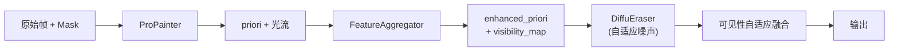

# FeatureAggregator 集成方案

将时间可见性感知特征聚合集成到 ProPainter + DiffuEraser pipeline。



## Proposed Changes

### ProPainter — 返回光流

#### [MODIFY] [inference.py](file:///home/hj/DiffuEraser_new/propainter/inference.py)
#### [MODIFY] [inference_OR.py](file:///home/hj/DiffuEraser_new/propainter/inference_OR.py)

两个文件做相同修改：

1. **forward 签名** 新增 `return_flow=False` 参数
2. **返回值** (L539-542 / L576-579)：

```diff
 if return_frames:
-    return comp_frames
+    if return_flow:
+        return comp_frames, pred_flows_bi
+    return comp_frames
 else:
     return output_path
```

> `pred_flows_bi` 是 `(flows_f, flows_b)` tuple，shape 均为 `(1, T-1, 2, H, W)`，已经过 RecurrentFlowCompleteNet 补全。

---

### DiffuEraser — 可见性自适应噪声

#### [MODIFY] [diffueraser.py](file:///home/hj/DiffuEraser_new/diffueraser/diffueraser.py)

1. **forward 签名** (L311-315) 新增 `noise_scale_map=None`
2. **加噪位置** (L504)：

```diff
-noisy_latents = self.noise_scheduler.add_noise(latents, noise, timesteps)
-latents = noisy_latents
+if noise_scale_map is not None:
+    noise_scale = noise_scale_map[:real_video_length].to(latents.device)
+    if noise_scale.shape[-2:] != latents.shape[-2:]:
+        noise_scale = F.interpolate(noise_scale, size=latents.shape[-2:], mode='bilinear', align_corners=False)
+    scaled_noise = noise * noise_scale
+    noisy_latents = self.noise_scheduler.add_noise(latents, scaled_noise, timesteps)
+else:
+    noisy_latents = self.noise_scheduler.add_noise(latents, noise, timesteps)
+latents = noisy_latents
```

3. **添加 import**: `import torch.nn.functional as F` (检查是否已存在)

#### [MODIFY] [diffueraser_OR.py](file:///home/hj/DiffuEraser_new/diffueraser/diffueraser_OR.py)

同上述修改，对应位置 L322-325 和 L521。

> [!IMPORTANT]
> `diffueraser_OR.py` 没有 `priori_frames` 参数，OR 流程中 priori 通过文件路径传入。需要额外添加 `priori_frames=None` 参数支持直接传帧。否则 enhanced_priori 无法传入。

---

### 新模块

#### [NEW] [feature_aggregator.py](file:///home/hj/DiffuEraser_new/feature_aggregator.py)

从现有 `Feature_aggregator.py` 复制并重命名为 Python 命名规范（下划线小写）。包含：
- `FeatureAggregator.aggregate_frames()` — 多帧聚合
- `compute_adaptive_noise_scale()` — 可见性→噪声缩放图
- `visibility_adaptive_blend()` — PP/DE 结果融合

---

### 主流程集成

#### [MODIFY] [run_BR.py](file:///home/hj/DiffuEraser_new/run_BR.py)

1. **Import** (顶部): `from feature_aggregator import FeatureAggregator, compute_adaptive_noise_scale, visibility_adaptive_blend`
2. **ProPainter 调用** (L542-548)：加 `return_flow=True`，解包结果
3. **插入 FeatureAggregator** (L549 之后)：计算 enhanced_priori + noise_scale_map
4. **DiffuEraser 调用** (L564-570)：`priori_frames=enhanced_priori` + `noise_scale_map=noise_scale_map`
5. **新增 CLI 参数**: `--use_feature_aggregator` 开关（默认 `False`）

#### [MODIFY] [run_OR.py](file:///home/hj/DiffuEraser_new/run_OR.py)

类似修改，作用于 `process_single_video()` 函数 (L428-474)。

> [!WARNING]
> `run_OR.py` 的 DiffuEraser 调用使用 `priori=priori_path`（文件路径），而非 `priori_frames`。需要先给 `diffueraser_OR.py` 加 `priori_frames` 支持，才能传入 enhanced_priori。

---

## 新增 CLI 参数

| 参数 | 默认值 | 说明 |
|------|--------|------|
| `--use_feature_aggregator` | `False` | 是否启用特征聚合 |
| `--temporal_radius` | `10` | 时间聚合半径 |
| `--noise_min_scale` | `0.1` | 高可见性区域最小噪声 |
| `--noise_max_scale` | `1.0` | 低可见性区域最大噪声 |

---

## Verification Plan

### Automated Tests
1. 语法检查: `python -c "import ast; ..."`
2. `--help` 验证新参数
3. 单视频 BR 测试（`--use_feature_aggregator`)
4. 对比 baseline vs feature_aggregator 的 PSNR/SSIM

### Manual Verification
- 检查可见性图可视化 (mean/min/max)
- 对比有无 aggregator 的输出质量
